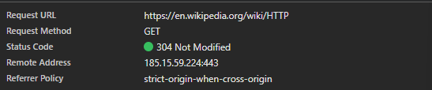
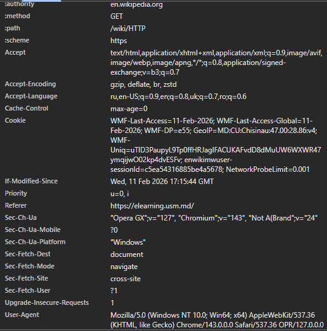
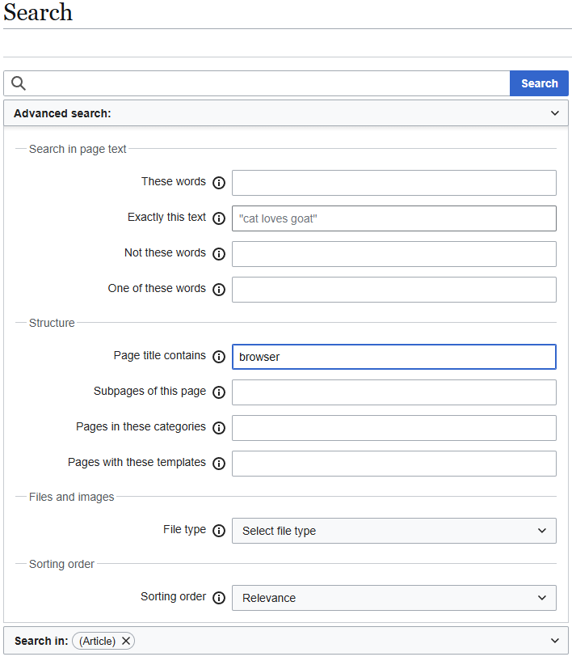
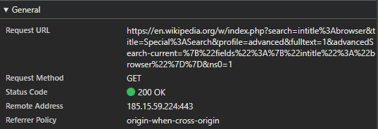
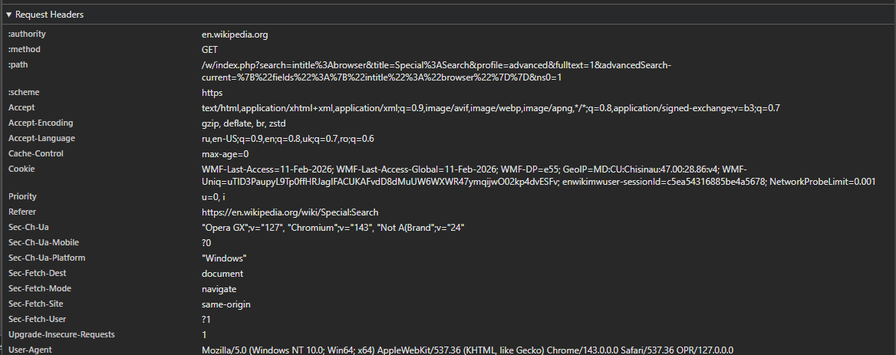

# Лабораторная работа №1. HTTP
### Дисциплина : *PHP*
### Выполнил студент : *Бритков Егор*
### Группа : *I2402*

«Лабораторная работа посвящена анализу HTTP-запросов с использованием инструментов разработчика браузера и составлению собственных HTTP-запросов». 

### Инструкция по запуску проекта:
Необходимы:
- Браузер
- Интернет
---

## Цель работы :


- Понять, что происходит, когда пользователь открывает сайт.

- Научиться находить и анализировать HTTP-запросы в браузере.

- Разобраться в назначении методов GET, POST, PUT, DELETE.
 
 ## Условие
 ### Задание 1. Анализ HTTP-запросов.
 #### Часть 1
  Открываю сайт Wikipedia по ссылке :
  https://en.wikipedia.org/wiki/HTTP

  Захожу в инструменты разработчика и нахожу вкладку *Network*. Обновляем страницу и находим первый запрос к странице (он помечен как `HTTP`).

  

  Изучаем его по следующим аспектам:

  #### 1. URL Запрос 
  `https://en.wikipedia.org/wiki/HTTP`
  #### 2. Метод запроса (Request method)
  **GET**

  Метод GET используется для получения данных с сервера без изменения информации. Страница просто загружается.

  #### 3. Статус ответа (Respons status)
  304 Not Modified - страница есть, она не изменилась.

  #### 4. Заголовки запроса и ответа
  
  
  *Здесь описаны служебные и технические заголовки.*
  
---
  ### Разберём основные заголовки запроса:

  - `:method` - **GET**
  
  Метод **GET** используется для получения данных со страницы.

  - `:path` - /wiki/HTTP

Путь к странице сервера.
 
 - `:scheme` - https

 Протокол передачи данных (защищённое соединение)

 - `:authority` - en.wikipedia.org

Домен сайта

- `Accept` - Показывает возможные принимемык форматы данных
    - html,
    - xml,
    - изображения,
    - другие форматы ...

- `Accept-language` - предпочитаемые языки
    - ru,
    - en-US,
    - en-UK ...

- `User-agent` - Информация о браузере и Операционной Системе пользователя.
```
Mozilla/5.0 (Windows NT 10.0; Win64; x64) AppleWebKit/537.36 (KHTML, like Gecko) Chrome/143.0.0.0 Safari/537.36 OPR/127.0.0.0
```
#### 5. Тело запроса
Тело запроса отсутствует, так как метод **GET** не передает тело.

Тело ответа содержит HTML-код страницы Wikipedia.

---
### Дополнительные запросы
При загрузке страницы отправляются следующие дополнительные запросы: 
- CSS,
- JS,
- Шрифты,
- Изображения ...

Необходимо для корректного отображения сайта.

---
Далее необходимо по заданию перейти по следующей ссылке:

 https://en.wikipedia.org/wiki/HTTPdsfdfs

*повторяем анализ запроса для этой ссылки*

#### Адрес: 
`https://en.wikipedia.org/wiki/HTTPdsfdfs`
#### Статус ответа:
404 Not Found

Данная страница не существует, поэтому и был получен статус ответа `404`.

---

### Задание 2. Анализ HTTP-запросов.
#### Часть 2
Переходим по ссылке:
https://en.wikipedia.org/wiki/Special:Search

Выполним поиск по слову `browser`.



Нахожу запрос поиска в `Network`

Изучим теперь здесь следующие аспекты:

#### URL Запроса :
https://en.wikipedia.org/w/index.php?search=intitle%3Abrowser&title=Special%3ASearch&profile=advanced&fulltext=1&advancedSearch-current=%7B%22fields%22%3A%7B%22intitle%22%3A%22browser%22%7D%7D&ns0=1

Используется метод **GET** так как поиск не изменяет данные на сервере.

#### Query Parameters : 
В запросе передаются следующие параметры:

| **Параметр**    | **Значение** | **Описание** |
|:---------------:|:------------:|:------------:|
|       URL       | */wiki/HTTP*  | Путь к странице на сервере |
| Метод           | GET          | Метод запроса, для получения данных |
| Статус          | 200 OK       | Запрос успешно выполнен |
| User-Agent      | Mozilla/5.0 (Windows NT 10.0; Win64; x64) ... | Информация о браузере и OC |


---


---


### Задание 3. Анализ HTTP-запросов. 
#### Часть 3
Повторяем анализ HTTP-запроса для следующего сайта: 

`YouTube`
#### URL Запроса:

https://www.youtube.com

#### Метод :
 **GET** - метод для получения данных

####  Статус ответа :
200 OK - Запрос успешно выполнен

#### User-Agent :
```
Mozilla/5.0 (Windows NT 10.0; Win64; x64) AppleWebKit/537.36 (KHTML, like Gecko) Chrome/143.0.0.0 Safari/537.36 OPR/127.0.0.0
```

---
### Задание 4. Составление HTTP-запросов

#### 1. Необходимо составить GET-запрос к серверу по адресу http://sandbox.usm.com

Указать в заголовке User-Agent свою Фамилию и Имя.

```
GET / HTTP/1.1
Host: sandbox.usm.com
User-Agent: Egor Britcov
```

`User-Agent` - строка, которая идентифицирует браузер или клиента.

#### 2. Необходимо составить POST-запрос к серверу по адресу http://sandbox.usm.com/cars

Указать в теле запроса следующие параметры:
- `make`: марка автомобиля (например, "Toyota")
- `model`: модель автомобиля (например, "Corolla")
- `year`: год выпуска автомобиля (например, 2020)

```
POST /cars HTTP/1.1
Host: sandbox.usm.com

make=Toyota&Model=Corolla&Year=2020
```
`POST` - используется для отправки данных на сервер<br>
`GET` - используется для получения данных с сервера клиентом<br>
`PUT` - Обновляет текущий ресурс<br>
`PATCH` - Частично обновляет текущий ресурс<br>
`DELETE` - Удаляет ресурс

#### 3. Необходимо составить PUT-запрос по адресу http://sandbox.usm.com/cars/1

Указать в заголовке `User-Agent` имя и фамилию, в заголовке `Content-Type` значение `application/json` и в теле запроса следующие параметры:
```json
{
 "make": "Toyota",
 "model": "Corolla",
 "year": 2021
}
```

```
PUT /cars/1 HTTP/1.1
Host: sandbox.usm.com
User-Agent: Egor Britcov
Content-Type: application/json

{
  "make": "Toyota",
  "model": "Corolla",
  "year": 2021
}
```

*Разница между PUT и PATCH заключается в том, что PUT полностью обновляет существующий ресурс, а PATCH частично.*

То есть:
```
PUT/student/12 -  данные пользователя обновятся полностью.

PATCH/student/12 -  изменятся отдельно выбранные поля.
```
#### 4. Напишите один из возможных вариантов ответа сервера следующий запрос:

```
POST /cars HTTP/1.1
Host: sandbox.com
Content-Type: application/json
User-Agent: John Doe
model=Corolla&make=Toyota&year=2020
```

Пример ответа сервера на запрос:

```HTTP/1.1 201 Created
Date: Thu, 12 Feb 2026 14:23:56 GMT
Server: Sodium/1.2.53
Content-Type: application/json
Location: https://sandbox.com/cars/123

{
  "id": 220,
  "model": "Corolla",
  "make": "Toyota",
  "year": 2020
}
```

#### Предположим ситуации, когда сервер на запрос выше может вернуть HTTP-коды состояния 200, 201, 400, 401, 403, 404, 500.

### 200 OK

Возвращается, если:

- Машина не создаётся заново, а, например, происходит обновление существующей записи.

- Или сервер просто подтверждает успешную обработку запроса без создания нового ресурса.


### 201 Created

Возвращается, если:

- Новый автомобиль успешно создан в базе данных.

- Обычно добавляется заголовок `Location` с URL созданного ресурса.

Это наиболее логичный код для данного запроса.


### 400 Bad Request

Возвращается, если:

- Неверный формат данных.

- Отсутствуют обязательные поля (model, make, year).

- Неверный Content-Type (указан application/json, но тело запроса отправлено в формате x-www-form-urlencoded — что как раз есть в примере).

- year передан строкой вместо числа.

- Ошибка синтаксиса JSON.

  *Возможен этот статус, так как:*
  
  Заголовок показывает, что ожидается JSON-тело

```
Content-Type: application/json
```

Но получает

```
model=Corolla&make=Toyota&year=2020
```

### 401 Unauthorized

Возвращается, если:

- Требуется авторизация.

- Отсутствует заголовок `Authorization`.

- Токен истёк или неверный.

### 403 Forbidden

Возвращается, если:

- Пользователь авторизован, но:

  - У него нет прав создавать автомобили.

  - Роль не позволяет выполнять POST-запросы.

  - IP заблокирован.


### 404 Not Found

Возвращается, если:

- Ресурс /cars не существует.

- Неверный URL.

- API отключено или маршрут не настроен.


### 500 Internal Server Error

Возвращается, если:

- Ошибка базы данных.

- Исключение на сервере.

- Непредвиденная ошибка в коде.

- Сервер не смог обработать запрос по внутренним причинам.

## Список источников
1. https://en.wikipedia.org/wiki/HTTP
2. https://elearning.usm.md/mod/page/view.php?id=298554
3. https://elearning.usm.md/pluginfile.php/755882/mod_resource/content/2/PHP_01_Introduction_To_Web_Dev.pdf
