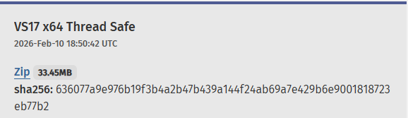
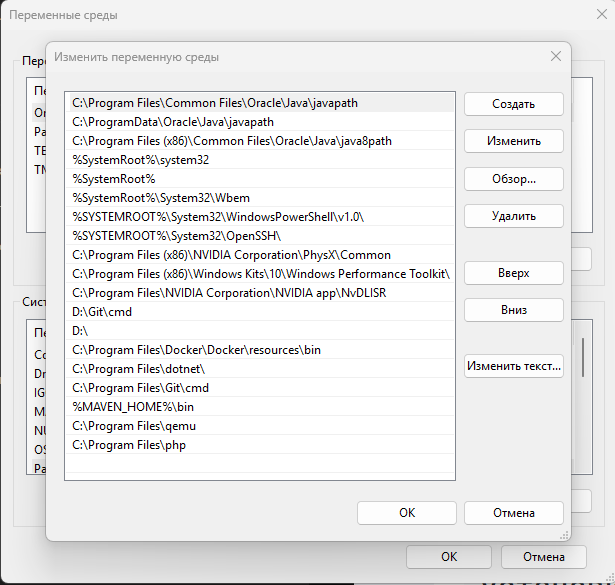
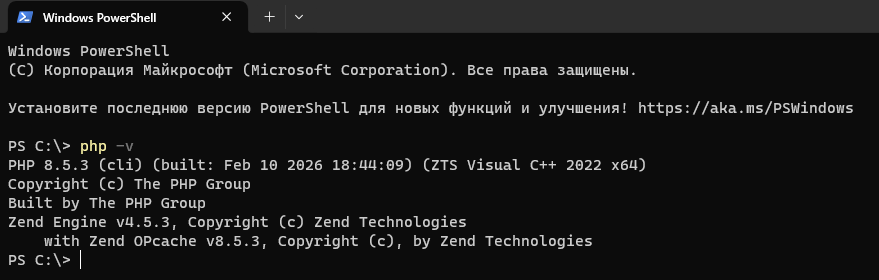
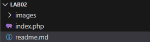
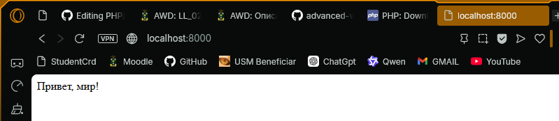
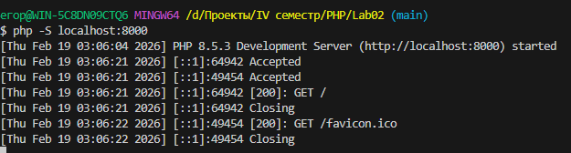

# Лабораторная работа №2. Установка и первая программа на PHP
### Дисциплина : *PHP*
### Выполнил студент : *Бритков Егор*
### Группа : *I2402*

---

## Цель работы :
Целью данной лабораторной работы является установка и настройка среды разработки для работы с языком программирования PHP, а также создание первой программы на PHP.

## Ход Работы

### Установка PHP

Существует два способа установки PHP - вручную и через готовый пакет XMAPP.

Я выбрал установку чистую установку PHP

---
1. Перехожу на сайт (https://www.php.net/downloads.)

2. Загружаю актуальную версию PHP. 



Далее необходимо добавить PHP в PATH:
- Win + R => sysdm.cpl
- Дополнительно => Переменные среды
- В "Системные переменные" => Path => Создать



Проверям установлен ли PHP



---

### Первая программа на PHP

Создаю файл `index.php` в директории проекта



Вставляю код в текстовый редактор:

```php
<?php

echo "Привет, мир!";
```

Далее запускаем программу с помощью встроенного веб-сервера PHP

Выполняю в терминале VS Code:

```
php -S localhost:8000
```
Открывю в браузере:

```
http://localhost:8000
```



Обращаем внимание на терминал!



Здесь прописаны коды состояния, используемые методы и прочие необходимые данные.

---

### Вывод данных в PHP
Необходимо вывести строку "Hello, World!" используя функцию `echo` и `print`.

как должно выглядеть:

```
Hello, World with echo!
Hello, World with print!
```

Код на PHP для вывода:

```php
<?php

echo "Hello, World with echo!";
echo "<br />";

print "Hello, World with print!";
?>
```

Результат:


---

### Работа с переменными и выводом

1. Необходимо создать две переменные:
    - Целочисленную переменную $days со значением 288.
    - Строковую переменную $message с текстом: Все возвращаются на работу!.

2. Также необходимо вывести значения переменных на экран несколькими способами:
    - С использованием конкатенации. Конкатенация - это объединение строк, в PHP используется оператор .:
    - С использованием двойных кавычек.
3. Использовать переход на новую строку в выводе с помощью `<br />`

Код:

```php
<?php
$days = 288;
$message = "Все возвращаются на работу!";

// Конкатенация
echo "Количество дней: " . $days . "<br />";
echo $message . "<br /><br />";

// двойные кавычки
echo "Количество дней: $days<br />";
echo "$message";

?>
```
Разъяснение:
- В PHP переменные начинаются с $
- Тип указывать не нужно (PHP сам определяет)
- В двойных кавычках переменные подставляются автоматически:
- `<br />` - это HTML-тег переноса строки (аналог Enter в браузере).
---

### Контрольные вопросы
1. Какие способы установки PHP существуют?

Существует два основных способа установки PHP: установка только интерпретатора PHP с официального сайта с последующим добавлением его в системную переменную Path, либо установка готовых сборок (например, XAMPP), которые включают PHP вместе с веб-сервером и базой данных. Первый способ даёт больше гибкости и контроля, второй — проще и быстрее для начальной настройки среды разработки.

2. Как проверить, что PHP установлен и работает?

Проверить установку PHP можно через терминал, выполнив команду php -v, которая выводит версию установленного интерпретатора. Если версия отображается без ошибок, значит PHP установлен корректно. Дополнительно можно создать PHP-файл и запустить встроенный сервер командой php -S localhost:8000, после чего открыть страницу в браузере и убедиться, что код выполняется.

3. Чем отличается оператор echo от print?

Оператор echo используется для вывода данных и может выводить несколько строк одновременно, при этом он работает немного быстрее и не возвращает значение. Оператор print также выводит данные, но принимает только один аргумент и возвращает значение 1, поэтому его можно использовать в выражениях. На практике чаще применяется echo, так как он более гибкий.