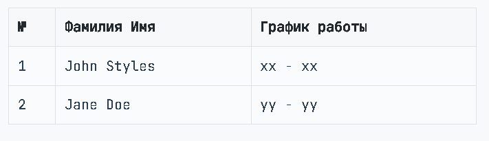
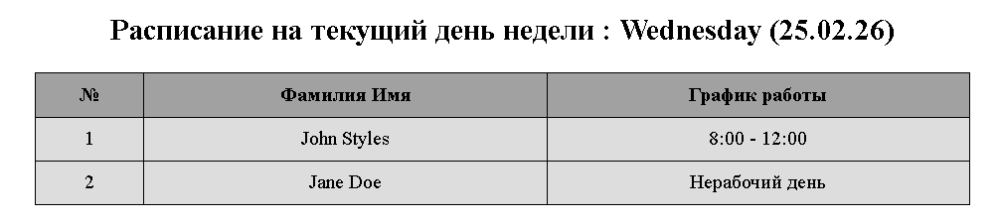
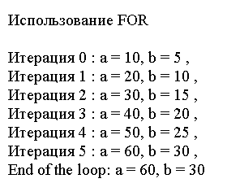
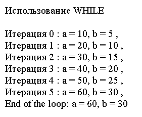
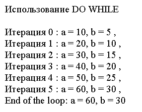

# Лабораторная работа №3. Управляющие конструкции
### Дисциплина : *PHP*
### Выполнил студент : *Бритков Егор*
### Группа : *I2402*

---

## Цель работы :

Целью данной лабораторной работы является изучение и применение на практике управляющих конструкций в PHP.

## Ход Работы
### Задание 1

Используя функцию `date()`, создать таблицу с расписанием, формируемым на основе текущего дня недели.

```php 
$dayOfWeek = date('N')
```

Ниже пример таблицу которая должна получиться:



#### Реализация расписания

Были созданы две функции для каждого из работников, которые проверяют текущи день недели посредством логических операторов `||` и условных операторов `if else` :

```php
<?php

$dayOfWeek =  date('N');

# График для John Styles
if ($dayOfWeek == 1 || $dayOfWeek == 3 || $dayOfWeek == 5) {
    $johnTime = "8:00 - 12:00";
} else  {
    $johnTime = "Нерабочий день";
}

# График для Jane Doe
if ($dayOfWeek == 2 || $dayOfWeek == 4 || $dayOfWeek == 6) {
    $janeTime = "12:00 - 16:00";
} else {
    $janeTime = "Нерабочий день";
}

?>
```

#### Вывод данных

Здесь PHP встроен прямо в сам HTML, подставляем PHP в разметку через `<?php ... ?>`:

Так мы делаем таблицу динмической в момент запроса.

```html
<!DOCTYPE html>
<html>
<head>
    <meta charset="UTF-8">
    <title>Расписание работы</title>
    <style>
        table {
            border-collapse: collapse;
            width: 50%;
            justify-content: center;
            margin: 0 auto;

        }
        th, td {
            border: 1px solid black;
            padding: 8px;
            text-align: center;
        }
        th {
            background-color: #a1a1a1;
        }
        tr {
            background-color: #dddddd;
        }
    </style>
</head>
<body>

<h2 style="text-align: center;  ">Расписание на текущий день недели : <?php echo date('l') . " " . date('(d.m.y)'); ?></h2>

<table>
    <tr>
        <th>№</th>
        <th>Фамилия Имя</th>
        <th>График работы</th>
    </tr>
    <tr>
        <td>1</td>
        <td>John Styles</td>
        <td><?php echo $johnTime; ?></td>
    </tr>
    <tr>
        <td>2</td>
        <td>Jane Doe</td>
        <td><?php echo $janeTime; ?></td>
    </tr>
</table>

</body>
</html>
```

#### Результат вывода:



---

### Задание 2
#### Работа с циклами 

`For, While, Do While`

Здесь нужно было реализовать логику цикла `for`, где на каждой итерации выводились бы значения `a` и `b` , а также реалиовать это для циклов `while` и `do while`.

---

##### Цикл `for`:

```php
<?php
echo "Использование FOR </br><br/>";
$a = 0;
$b = 0;

for ($i = 0; $i <= 5; $i++) {
   $a += 10;
   $b += 5;
   
   echo "Итерация $i : а = $a, b = $b ,<br />";
}

echo "End of the loop: a = $a, b = $b<br/><br/><br/> ";

?>

<?php
```

Результат:



##### Цикл `while`:

```php
<?php

echo "Использование WHILE </br><br/>";

$a = 0;
$b = 0;
$i = 0;

while ($i <= 5) {
    $a += 10;
    $b += 5;

   echo "Итерация $i : а = $a, b = $b ,<br />";
    
    $i++;
}

echo "End of the loop: a = $a, b = $b<br/><br/><br/> ";

?>
```

Результат:



##### Цикл `do while`:

```php
<?php
echo "Использование DO WHILE </br><br/>";

$a = 0;
$b = 0;
$i = 0;

do {
    $a += 10;
    $b += 5;
    
    echo "Итерация $i : а = $a, b = $b ,<br />";

    $i++;
} 
while ($i <= 5);
echo "End of the loop: a = $a, b = $b<br/><br/><br/>";

?>
```

Результат:



---
### Контрольные вопросы:

1. В чем разница между циклами `for`, `while` и `do-while`? В каких случаях лучше использовать каждый из них?

- for используют, когда заранее известно количество итераций (есть счётчик).

- while используют, когда цикл должен выполняться, пока условие истинно (количество повторений заранее неизвестно).

- do-while похож на while, но выполняется минимум один раз, потому что проверка условия идёт после выполнения тела цикла.

2. Как работает тернарный оператор ? : в PHP?

Тернарный оператор - это краткая форма `if-else`.

```
Условие ? если_true : если_false;
```
Если условие истинно — возвращается первое значение, иначе второе.

3. Что произойдет, если в do-while поставить условие, которое изначально ложно?

Тело цикла выполнится один раз, а затем цикл завершится, потому что проверка условия происходит после первой итерации.

---

### Библиография

1. https://elearning.usm.md/mod/page/view.php?id=298554
2. https://www.php.net/manual/ru/language.control-structures.php
3. https://elearning.usm.md/pluginfile.php/823544/mod_resource/content/1/%28PHP%29%20DataTypes.pdf
