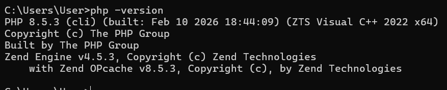
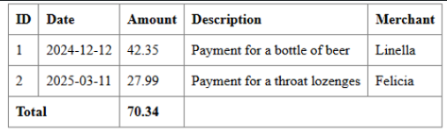
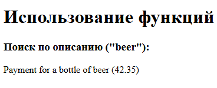
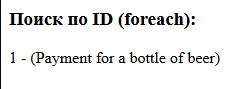
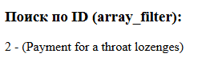
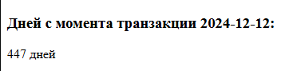
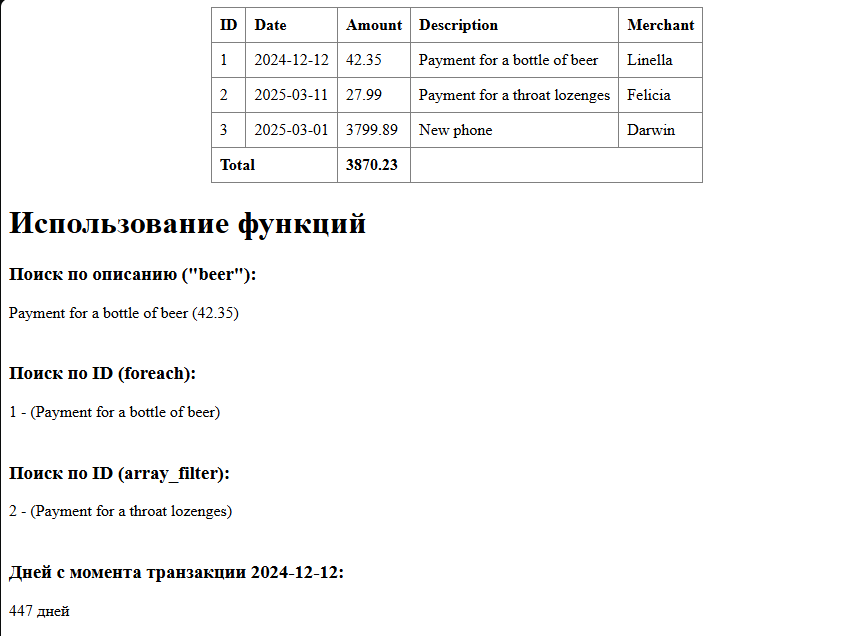
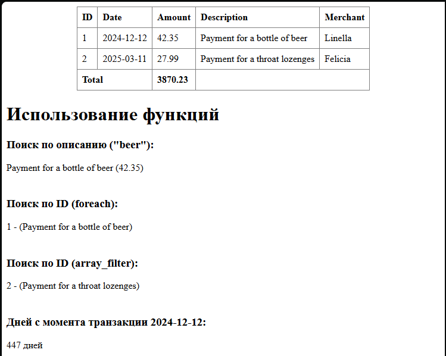
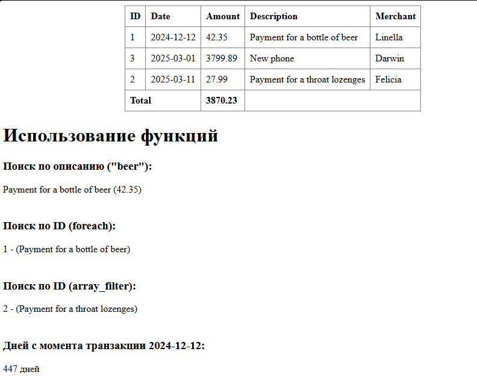
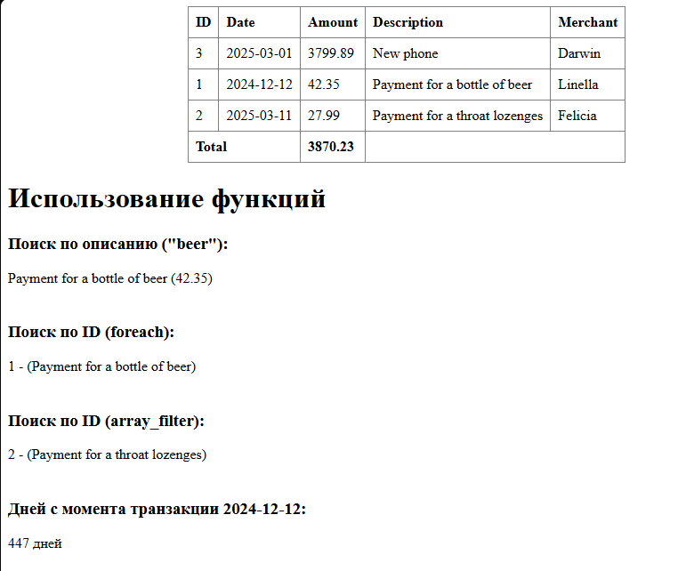

# Лабораторная работа №4. Массивы и Функции
### Дисциплина : *PHP*
### Выполнил студент : *Бритков Егор*
### Группа : *I2402*

---

## Цель работы :

Освоить работу с массивами в PHP, применяя различные операции: создание, добавление, удаление, сортировка и поиск. Закрепить навыки работы с функциями, включая передачу аргументов, возвращаемые значения и анонимные функции.

## Ход Работы

### Задание 1. Работа с массивами

Необходимо разработать систему управления банковскими транзакциями с возможностью:

- добавления новых транзакций;
- удаления транзакций;
- сортировки транзакций по дате или сумме;
- поиска транзакций по описанию.

#### Подготовка среды

Через команду `php -version` проверяем установлена ли актуальная версия PHP: 



Создаем файл `index.php`.

Включаем строгую типизацию:

```php
<?php
declare(strict_types=1);
```

Далее создаем Массив транзакций:

```php
$transactions = [
    [
        "id" => 001,
        "date" => "2024-12-12",
        "amount" => 42.00,
        "description" => "Payment for a bottle of beer",
        "merchant" => "Linella",
    ],
    [
        "id" => 002,
        "date" => "2025-03-11",
        "amount" => 27.00,
        "description" => "Payment for a throat lozenges",
        "merchant" => "Felicia",
    ],
];
```

Далее выводим список транзакций в HTML-таблицу использую `foreach`:

```html
<table border='1'>
    <thead>
        <tr>
            <th>ID</th>
            <th>Date</th>
            <th>Amount</th>
            <th>Description</th>
            <th>Merchant</th>
        </tr>   
    </thead>

    <tbody>
        <?php foreach ($transactions as $transactions): ?>
            <tr>
                <td><?= $transactions['id'] ?></td>
                <td><?= $transactions['date'] ?></td>
                <td><?= $transactions['amount'] ?></td>
                <td><?= $transactions['description'] ?></td>
                <td><?= $transactions['merchant'] ?></td>
            </tr>
        <?php endforeach; ?>
    </tbody>
   <tr>
        <td colspan="2"><strong>Total</strong></td>
        <td><strong><?= $totalAmount ?></strong></td>
        <td colspan="2"></td>
    </tr>
</table>
```

#### Реализация функций

Необходимо было создать и использовать сдледующие функции:

1. Функция которая вычисляет общую сумму всех транзакций.

(Необходимо вывести сумму всех транзакций в конце таблицы.)

```php
/**
 * Вычисляет общую сумму всех транзакций.
 *
 * Проходит по массиву транзакций и суммирует значения поля 'amount'.
 *
 * @param array $transactions -  Массив транзакций
 * @return float Общая сумма всех транзакций
 */
function calculateTotalAmount(array $transactions): float
{
    $total = 0.0;

    foreach ($transactions as $transaction) {
        $total += $transaction['amount'];
    }

    return $total;
}

$totalAmount = calculateTotalAmount($transactions);
```


Функция принимает Массив Транзакицй как параметр и использую `foreach` проходится по каждой транзакции массива с транзакциями обновляя `total` который хранит значения суммы полей `amount`.

`:float` - показывает какого типа данных будет результат выполнения функции

В конце мы создаем переменную к которой можем обратиться для вызова функции в HTML и туда же сохранить результат.

---

2. Функция которая ищет транзакцию по части ее описания:

```php
/**
 * Осуществляет поиск транзакции по части её описания.
 *
 * Возвращает первую найденную транзакцию, в описании которой
 * содержится указанная строка.
 *
 * @param string $descriptionPart -  Часть строки для поиска в описании
 * @param array $transactions - Массив транзакций
 * @return array|null Найденная транзакция или null, если совпадений нет
 */
function findTransactionByDescription(string $descriptionPart, array $transactions): ?array
{
    foreach ($transactions as $transaction) {
        if (strpos($transaction['description'], $descriptionPart) !== false) {
            return $transaction;
        }
    }

    return null;
}

$foundByDescription = findTransactionByDescription("beer", $transactions);
```



Функция принимает строку `$descriptionPart` и массив транзакций как парметры.

Используя `foreach` функция проходит по каждой транзакции массива и проверяет наличие искомой подстроки в описании транзакции с помощью `strpos()`. Функция возвращает транзакцию если совпадения найдены, если нет цикл завершается без результатов, а сама функция вернет `null`.

`?array` - показывает что функция может вернуть либо массив (найденную транзакцию) либо `null` если ничего не найдено.

`(strpos($transaction['description'], $descriptionPart) !== false)` - провряет действительно ли найдена подстрока

В конце создаем переменную через которую можем обратиться к функции и туда же сохранить результат вызова функции.

---

3. Функция которая ищет транзакцию по ID:

- С помощью цикла `foreach`:

```php
/**
 * Осуществляет поиск транзакции по её идентификатору с использованием цикла foreach.
 *
 * @param int $id - Идентификатор транзакции
 * @param array $transactions - Массив транзакций
 * @return array|null Найденная транзакция или null, если не найдена
 */
function findTransactionByIdForeach(int $id, array $transactions): ?array
{
    foreach ($transactions as $transaction) {
        if ($transaction['id'] === $id) {
            return $transaction;
        }
    }

    return null;
}

$foundByIdForeach = findTransactionByIdForeach(1, $transactions);

```


Функция принимает `id` и массив транзакций как параметры и с помощью цикла `foreach` проходится по каждой транзакции находя совпадение `id` транзакции с id который мы ищем.
Если совпадение найдено функция возвращает транзакцию.

*Здесь производится строгое сравнение `===` и самого элемента и какого он типа.*

- С помощью функции `array_filter`:

```php
/**
 * Осуществляет поиск транзакции по её идентификатору
 * с использованием функции array_filter.
 *
 * @param int $id -  Идентификатор транзакции
 * @param array $transactions - Массив транзакций
 * @return array|null Найденная транзакция или null, если не найдена
 */
function findTransactionByIdArrayFilter(int $id, array $transactions): ?array
{
    $filtered = array_filter($transactions, function ($transaction) use ($id) {
        return $transaction['id'] === $id;
    });

    return !empty($filtered) ? reset($filtered) : null;
}

$foundByIdArrayFilter = findTransactionByIdArrayFilter(2, $transactions);
```


Функция принимает целое число `id` и массив транзакций как параметры.
Создаем переменную `filtered` куда будут сохранены найденые совпадения `id`. В отличие от `foreach` здесь используется встроенная функция `array_filter()` оторая применяет callback-функцию к каждому элементу массива и возвращает новый массив только с теми элементами, где условие истинно.

`use ($id)`  это конструкция замыкания , которая позволяет передать переменную $id из внешней области видимости внутрь анонимной функции. Без use функция не увидела бы значение $id.

$transaction['id'] === $id - строгое сравнение идентификаторов. Используем ===, чтобы сравнивать и значения, и типы данных (оба должны быть int), что делает поиск более надёжным.

- `!empty($filtered)` - проверяем есть ли вообще результаты
- `reset($filtered)` — получить первый элемент отфильтрованного массива (так как array_filter сохраняет ключи, reset возвращает значение первого элемента)

Есл и массив пустой вернется `null`.

Одним из главных плюсов использования именно встроенной функции `array_filter`, а не `foreach` это то что foreach останавливается при первом нахождении, а array_filter проходит весь массив.

---

4. Функция, которая возвращает количество дней между датой транзакции и текущим днём.

```php
/**
 * Вычисляет количество дней, прошедших с момента совершения транзакции.
 *
 * Сравнивает переданную дату транзакции с текущей датой
 * и возвращает разницу в днях.
 *
 * @param string $date - Дата транзакции в формате Y-m-d
 * @return int Количество дней с момента транзакции
 */
function daySinceTransaction(string $date): int
{
    $transactionDate = new DateTime($date);
    $today = new DateTime('today');
    $difference = $today->diff($transactionDate);

    return (int)$difference->days;
}

$daysSince = daySinceTransaction("2024-12-12");
```


Функция принемает строку с датой как параметр и вернет целое число.
Создаем объект `transactionDate` на основе класса `DateTime` из переданной строки.

`new DateTime('today')` создаёт объект даты для текущего дня. Ключевое слово `'today'` устанавливает время на 00:00:00 текущего дня, что обеспечивает корректный расчёт полных дней.

`$today->diff($transactionDate)` - метод `diff()` вычисляет разницу между двумя датами и возвращает объект DateInterval. Этот объект содержит информацию о разнице в годах, месяцах, днях, часах и т.д.

`(int)$difference->days` явное приведение типа к int. Хотя days уже является целым числом, это делает код более явным и соответствует объявленному типу возврата `: int`.

---

5. Функция для добавления новой транзакции

```php
/**
 * Добавляет новую транзакцию в глобальный массив $transactions.
 *
 * Функция получает данные транзакции и добавляет их
 * в конец массива транзакций.
 *
 * Используется глобальная переменная $transactions.
 *
 * @param int $id - Идентификатор транзакции
 * @param string $date - Дата транзакции в формате Y-M-D
 * @param float $amount - Сумма транзакции
 * @param string $description - Описание транзакции
 * @param string $merchant - Название продавца 
 * @return void
 */
function addTransaction(
    int $id,
    string $date,
    float $amount,
    string $description,
    string $merchant
): void
{
    global $transactions;

    $newTransaction = [
        "id" => $id,
        "date" => $date,
        "amount" => $amount,
        "description" => $description,
        "merchant" => $merchant,
    ];

    $transactions[] = $newTransaction;
}

$add = addTransaction(3, "2025-03-01", 3799.89, "New phone", "Darwin");
$totalAmount = calculateTotalAmount($transactions);
```


Функция принимает пять параметров для создания новой транзакции и добавляет её в глобальный массив `$transactions`. В отличие от предыдущих функций, эта не возвращает значение `(: void)`, а напрямую модифицирует исходный массив.

`global $transactions;` — ключевая строка, которая даёт функции доступ к глобальной переменной $transactions, объявленной вне функции. Без этой строки PHP создал бы локальную переменную внутри функции, и изменения не сохранились бы в исходном массиве.

`$transactions[] = $newTransaction;` — оператор [] добавляет новый элемент в конец массива. 

После добавления новой транзакции мы можем сразу вызвать другие функции, calculateTotalAmount($transactions), чтобы получить обновлённую общую сумму с учётом новой записи.

6. Функция которая удаляет транзакцию

```php
/** 
 * 
 * Удаляет транзакцию из массива транзакций
 * 
 * @param int $id - ID по которому будем удалять транзакцию
 * @return bool - true - если транзакция, false - если не найдена
 */ 

function deleteTransaction(int $id): bool
{
    global $transactions;

    foreach ($transactions as $key => $transaction) {
        if ($transaction['id'] === $id) {
            unset($transactions[$key]);

            $transactions = array_values($transactions);
            return true;
        }
    }

    return false;
}

$delTransaction = deleteTransaction(3);
```


Функция принимает целое число `id` как параметр и проходится по массиву транзакций в поисках совпадения.
Если совпадение найдено функция вернет `true` если нет `false`.

`$transactions as $key => $transaction` - Это специальный синтаксис цикла foreach, который даёт доступ и к ключу, и к значению каждого элемента массива одновременно.

`$transactions = array_values($transactions);` - эта функция пересобирает заново массив "убирая дыры" после удаления транзакции восстанавливая последовательность ключей.

---

#### Сортировка

Ниже предствавлены две функции которые:

Сортирует транзакции по дате с использованием `usort()`:

```php
/**
 * Сортирует массив транзакций по дате (от старых к новым).
 *
 * Использует функцию usort() и сравнивает даты транзакций
 * с помощью strtotime().
 *
 * @param array &$transactions - Массив транзакций (& - передаётся по ссылке)
 * @return void
 */
function sortTransactionsByDate(array &$transactions): void
{
    usort($transactions, function ($a, $b) {
        return strtotime($a['date']) <=> strtotime($b['date']);
    });
}

$dateSorting = sortTransactionsByDate($transactions);
```



Эта функция сортирует массив транзакций по дате от самых старых к самым новым. Для сортировки используется встроенная функция usort(), которая сравнивает даты транзакций, предварительно преобразуя их в числовой формат времени с помощью strtotime(). Массив передаётся по ссылке (&), поэтому он изменяется напрямую без необходимости возвращать новый массив.

Для сравнения дат применяется оператор <=> (spaceship operator), который возвращает -1, 0 или 1 в зависимости от того, меньше, равно или больше первое значение второго.

А эта функция соритирует транзакции по сумме(убывание):

```php
$dateSorting = sortTransactionsByDate($transactions);

/**
 * Сортирует массив транзакций по сумме (по убыванию).
 *
 * Транзакции с большей суммой будут располагаться первыми.
 *
 * @param array &$transactions Массив транзакций
 * @return void
 */
function sortTransactionsByAmountDesc(array &$transactions): void
{
    usort($transactions, function ($a, $b) {
        return $b['amount'] <=> $a['amount'];
    });
}

$amountSortingDesc = sortTransactionsByAmountDesc($transactions);
```


Эта функция сортирует массив транзакций по сумме в порядке убывания, то есть транзакции с большей суммой располагаются первыми. Сортировка выполняется с помощью функции usort(), которая сравнивает значения поля amount. Для сравнения используется оператор <=>, возвращающий -1, 0 или 1, а порядок убывания достигается тем, что значения сравниваются как $b['amount'] <=> $a['amount']. Массив передаётся по ссылке (&), поэтому он изменяется непосредственно внутри функции.

---

### Задание 2. Работа с файловой системой

Необходимо:

- Создать директорию "image", в которой сохраните не менее 20-30 изображений с расширением .jpg.

- Затем создать файл index.php, в котором определите веб-страницу с хедером, меню, контентом и футером.

- Вывести изображения из директории "image" на веб-страницу в виде галереи.


#### Выполнение

```php
<?php
$dir = "image/";
$files = scandir($dir);
?>

<!DOCTYPE html>
<html>
<head>
<meta charset="UTF-8">
<title>Champions Gallery</title>
<link rel="stylesheet" href="style.css">
</head>

<body>

<header>
    <nav>
        <a href="#">About Champions</a> |
        <a href="#">News</a> |
        <a href="#">Lore</a>
    </nav>
</header>

<main>
    
<p>Welcome to the world of Legends</p>

<div class="gallery">

<?php

if ($files !== false) {

    for ($i = 0; $i < count($files); $i++) {

        if ($files[$i] != "." && $files[$i] != "..") {

            $path = $dir . $files[$i];

            echo "";
        }
    }

}

?>

</div>

</main>

<footer>
    <p>league of legends 2026</p>
</footer>

</body>
</html>
```

`$files = scandir($dir);` - считывает все файлы из папки

Цикл:

`for ($i = 0; $i < count($files); $i++)` - Создаётся переменная счётчик цикла.

`$i < count($files)` - Это условие выполнения цикла.

`count($files)` — возвращает количество элементов массива.

`if ($files[$i] != "." && $files[$i] != "..")` - здесь мы проверяем чтобы пропускался текущий каталог и родительский.

#### Результат


---

### Контрольные вопросы

1. Что такое массивы в PHP?
Массив в PHP — это структура данных, которая позволяет хранить несколько значений в одной переменной и обращаться к ним по индексу или ключу.

2. Каким образом можно создать массив в PHP?
Массив можно создать с помощью функции `array()` или короткого синтаксиса `[]`, перечислив элементы внутри скобок.

3. Для чего используется цикл `foreach`?
Цикл foreach используется для перебора элементов массива и выполнения операций с каждым элементом по очереди.

### Библиография

1. https://elearning.usm.md/mod/page/view.php?id=298554

2. https://elearning.usm.md/mod/lesson/view.php?id=329094

3. https://elearning.usm.md/mod/lesson/view.php?id=328958

4. https://elearning.usm.md/mod/lesson/view.php?id=329093