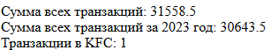
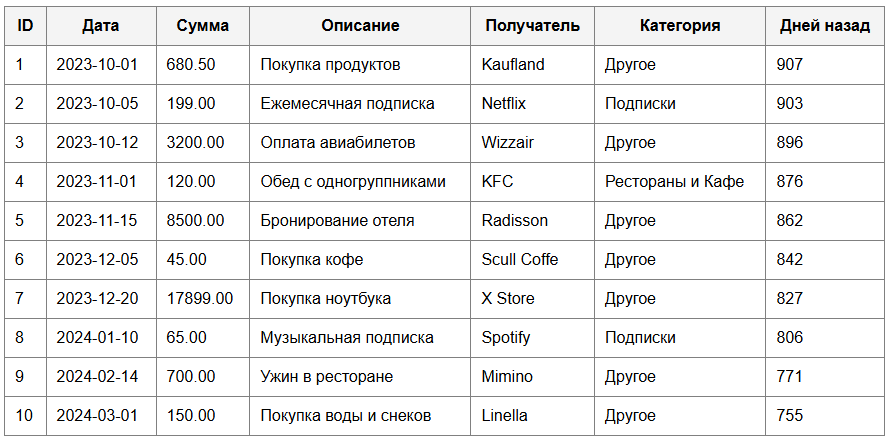
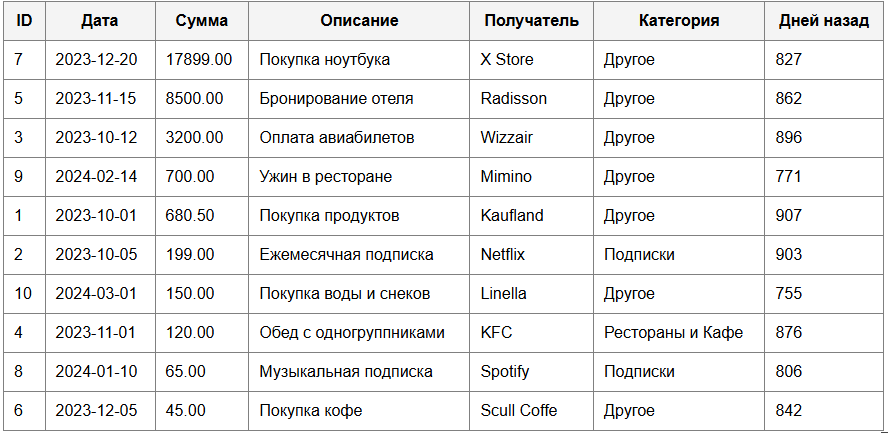

# Лабораторная работа №5. Объектно-ориентированное программирование в PHP
### Дисциплина : *PHP*
### Выполнил студент : *Бритков Егор*
### Группа : *I2402*

---

## Цель работы :

Освоить основы объектно-ориентированного программирования в PHP на практике. Научиться создавать собственные классы, использовать инкапсуляцию для защиты данных, разделять ответственность между классами, а также применять интерфейсы для построения гибкой архитектуры приложения.

## Условие

Необходимо разработать приложение для управления банковскими транзакциями.

Приложение должно позволять:

- хранить банковские транзакции;
- добавлять новые транзакции;
- удалять транзакции;
- искать транзакции;
- сортировать транзакции;
- выполнять вычисления над коллекцией транзакций;
- выводить данные в виде HTML-таблицы.
- В рамках лабораторной работы необходимо использовать объектно-ориентированный подход.

## Ход Работы

### Подготовка среды
Файл `index.php` открывается инструкцией `declare(strict_types=1);`, которая активирует режим строгой типизации. В контексте финансовых операций это выступает важным защитным механизмом: интерпретатор жестко контролирует соответствие типов данных для всех функций и методов. Такой подход исключает риск автоматического приведения типов, что позволяет избежать трудноуловимых ошибок при работе с денежными значениями.

```php
<?php
declare(strict_types=1);
```

---

### Класс Transaction

Создаю класс `Transaction` который будет описывать банковскую транзакцию

```php
class Transaction
{
    /**
     * @param int    $id          Уникальный идентификатор транзакции.
     * @param string $date        Дата транзакции (в формате YYYY-MM-DD).
     * @param float  $amount      Сумма транзакции.
     * @param string $description Описание платежа.
     * @param string $merchant    Получатель платежа.
     */
    public function __construct(
        private int $id,
        private string $date,
        private float $amount,
        private string $description,
        private string $merchant
    ) {
    }

    public function getId(): int { return $this->id; }
    public function getDate(): string { return $this->date; }
    public function getAmount(): float { return $this->amount; }
    public function getDescription(): string { return $this->description; }
    public function getMerchant(): string { return $this->merchant; }

    /**
     * Возвращает количество дней с момента транзакции до текущей даты.
     *
     * @return int Количество прошедших дней.
     */
    public function getDaysSinceTransaction(): int
    {
        $transactionDate = new DateTime($this->date);
        $currentDate = new DateTime();
        $interval = $currentDate->diff($transactionDate);
        
        return (int)$interval->format('%a');
    }
}
```
- Инкапсуляция: Все данные (id, дата, сумма, описание, магазин) скрыты внутри класса (режим private). Получить их можно только через специальные методы-геттеры.

- Конструктор: Все значения задаются один раз — строго в момент создания объекта.

- Логика: За расчет времени отвечает метод getDaysSinceTransaction(). Он использует стандартный класс DateTime, чтобы посчитать, сколько дней прошло с даты операции.

---

### Класс TransactionRepository

```php
class TransactionRepository implements TransactionStorageInterface
{
    /**
     * @var Transaction[] Массив транзакций.
     */
    private array $transactions = [];

    public function addTransaction(Transaction $transaction): void
    {
        $this->transactions[] = $transaction;
    }

    public function removeTransactionById(int $id): void
    {
        foreach ($this->transactions as $index => $transaction) {
            if ($transaction->getId() === $id) {
                unset($this->transactions[$index]);
                $this->transactions = array_values($this->transactions); // Переиндексация
                break;
            }
        }
    }

    public function getAllTransactions(): array
    {
        return $this->transactions;
    }

    public function findById(int $id): ?Transaction
    {
        foreach ($this->transactions as $transaction) {
            if ($transaction->getId() === $id) {
                return $transaction;
            }
        }
        return null;
    }
}
```

 Класс TransactionRepository: Его единственная задача — хранить список объектов и обеспечивать базовую работу с ними (CRUD).

- Защита данных: Весь массив с транзакциями ($transactions) скрыт внутри класса (свойство private). Изменить его напрямую извне не получится.

- Доступные методы: Для управления данными созданы функции addTransaction(), removeTransactionById(), getAllTransactions() и findById().

- Удаление данных: Чтобы убрать элемент, используется unset(). После этого массив обновляется через array_values(), чтобы индексы шли по порядку и не было пропусков в нумерации.

---

### Класс TransactionManager

```php
class TransactionManager
{
    public function __construct(
        private TransactionStorageInterface $repository
    ) {
    }

    public function calculateTotalAmount(): float
    {
        $total = 0.0;
        foreach ($this->repository->getAllTransactions() as $transaction) {
            $total += $transaction->getAmount();
        }
        return $total;
    }

    public function calculateTotalAmountByDateRange(string $startDate, string $endDate): float
    {
        $total = 0.0;
        $start = strtotime($startDate);
        $end = strtotime($endDate);

        foreach ($this->repository->getAllTransactions() as $transaction) {
            $txDate = strtotime($transaction->getDate());
            if ($txDate >= $start && $txDate <= $end) {
                $total += $transaction->getAmount();
            }
        }
        return $total;
    }

    public function countTransactionsByMerchant(string $merchant): int
    {
        $count = 0;
        foreach ($this->repository->getAllTransactions() as $transaction) {
            if (strcasecmp($transaction->getMerchant(), $merchant) === 0) {
                $count++;
            }
        }
        return $count;
    }

    public function sortTransactionsByDate(): array
    {
        $transactions = $this->repository->getAllTransactions();
        usort($transactions, function (Transaction $a, Transaction $b) {
            return strtotime($a->getDate()) <=> strtotime($b->getDate());
        });
        return $transactions;
    }

    public function sortTransactionsByAmountDesc(): array
    {
        $transactions = $this->repository->getAllTransactions();
        usort($transactions, function (Transaction $a, Transaction $b) {
            return $b->getAmount() <=> $a->getAmount();
        });
        return $transactions;
    }
}
```


Класс TransactionManager: В нем сосредоточена вся логика работы приложения, при этом сам класс данные в себе не хранит.

- Dependency Injection (Внедрение зависимостей): Репозиторий TransactionRepository попадает в менеджер через конструктор. Так обязанности разделены: менеджер управляет логикой, а репозиторий занимается хранением.


- calculateTotalAmount(): Считает общую сумму всех операций.

- calculateTotalAmountByDateRange(): Отбирает транзакции за нужный период и складывает их суммы.

- countTransactionsByMerchant(): Выдает количество платежей для конкретного продавца.

- sortTransactionsByDate() и sortTransactionsByAmountDesc(): Сортируют список по дате или убыванию суммы. Для этого используются функция usort и оператор «spaceship» (<=>).

---

### Класс TransactionTableRender

```php
final class TransactionTableRenderer
{
    /**
     * Генерирует HTML-код таблицы.
     *
     * @param Transaction[] $transactions
     * @return string
     */
    public function render(array $transactions): string
    {
        $html = '<table border="1" cellpadding="10" cellspacing="0" style="border-collapse: collapse; width: 100%; font-family: sans-serif;">';
        $html .= '<thead style="background-color: #f4f4f4;"><tr>';
        $html .= '<th>ID</th><th>Дата</th><th>Сумма</th><th>Описание</th><th>Получатель</th><th>Категория</th><th>Дней назад</th>';
        $html .= '</tr></thead><tbody>';

        foreach ($transactions as $transaction) {
            $category = $this->determineCategory($transaction->getMerchant());
            
            $html .= '<tr>';
            $html .= '<td>' . htmlspecialchars((string)$transaction->getId()) . '</td>';
            $html .= '<td>' . htmlspecialchars($transaction->getDate()) . '</td>';
            $html .= '<td>' . htmlspecialchars(number_format($transaction->getAmount(), 2, '.', '')) . '</td>';
            $html .= '<td>' . htmlspecialchars($transaction->getDescription()) . '</td>';
            $html .= '<td>' . htmlspecialchars($transaction->getMerchant()) . '</td>';
            $html .= '<td>' . htmlspecialchars($category) . '</td>';
            $html .= '<td>' . htmlspecialchars((string)$transaction->getDaysSinceTransaction()) . '</td>';
            $html .= '</tr>';
        }

        $html .= '</tbody></table>';
        return $html;
    }

    private function determineCategory(string $merchant): string
    {
        $merchantLower = strtolower($merchant);
        if (str_contains($merchantLower, 'market') || str_contains($merchantLower, 'grocery')) return 'Супермаркеты';
        if (str_contains($merchantLower, 'netflix') || str_contains($merchantLower, 'spotify')) return 'Подписки';
        if (str_contains($merchantLower, 'restaurant') || str_contains($merchantLower, 'cafe') || str_contains($merchantLower, 'kfc')) return 'Рестораны и Кафе';
        if (str_contains($merchantLower, 'airline') || str_contains($merchantLower, 'hotel')) return 'Путешествия';
        
        return 'Другое';
    }
}
```

Класс TransactionTableRenderer: Его единственная задача — создавать HTML-разметку для вывода данных.

- Принцип единственной ответственности: Код для отрисовки таблицы полностью отделен от бизнес-логики и работы с данными.

- Метод render(array $transactions): Получает список объектов и через цикл foreach запрашивает данные у каждого из них с помощью геттеров, формируя итоговую таблицу в формате HTML.

- Дополнительная логика: Внутри класса есть скрытый метод getMerchantCategory(). Он нужен, чтобы автоматически определять категорию магазина, опираясь на его название.

---

### Класс TransactionStorageInterface

```php
interface TransactionStorageInterface
{
    /**
     * Добавляет новую транзакцию в хранилище.
     *
     * @param Transaction $transaction Объект транзакции.
     * @return void
     */
    public function addTransaction(Transaction $transaction): void;

    /**
     * Удаляет транзакцию по ее идентификатору.
     *
     * @param int $id Идентификатор транзакции.
     * @return void
     */
    public function removeTransactionById(int $id): void;

    /**
     * Возвращает массив всех транзакций.
     *
     * @return Transaction[] Массив транзакций.
     */
    public function getAllTransactions(): array;

    /**
     * Ищет транзакцию по идентификатору.
     *
     * @param int $id Идентификатор транзакции.
     * @return Transaction|null Найденная транзакция или null, если не найдена.
     */
    public function findById(int $id): ?Transaction;
}
```

---

### Инициализация данных и их вывод

- Сборка приложения в основном коде: В главной части скрипта происходит объединение всех компонентов. Сначала создаются рабочие объекты (экземпляры) классов: $repository, $manager и $renderer.

- Подготовка данных: Автоматически создается 10 тестовых транзакций с разной информацией (варьируются даты, суммы и магазины). После этого все они по очереди добавляются в репозиторий через цикл.

- Работа с данными и вывод: С помощью менеджера проводятся необходимые вычисления: считается общая сумма всех операций и суммы за определенные периоды. В конце данные сортируются и отправляются в рендерер, который формирует итоговую таблицу для отображения на странице.

---

#### Результат работы программы

Реализация функций:



Таблица отсортированная по дате:



Таблица отсортированная по Сумме (убывание):\



---

### Контрольные вопросы

1. Зачем нужна строгая типизация в PHP и как она помогает?


Строгая типизация не дает PHP самостоятельно менять типы данных (например, превращать строку в число). Это избавляет от незаметных ошибок, когда система могла бы выдать неправильный итог из-за автоматического преобразования. Если тип данных не совпадает, программа просто остановится с ошибкой `TypeError`. Это особенно важно там, где нужны точные расчеты, например в финансах.

### 2. Что такое класс и из чего он состоит?


Класс — это своего рода «чертеж» или схема, по которой создаются объекты. Он объединяет в себе данные и действия над ними.
Основные части класса:

Свойства (поля): Переменные, которые хранят информацию об объекте.

Методы: Функции внутри класса, которые описывают, что объект умеет делать.

Конструктор `(__construct)`: Специальная функция, которая срабатывает сама в момент создания объекта, чтобы сразу задать ему нужные параметры.

### 3. Что такое полиморфизм и как он работает в PHP?


Полиморфизм позволяет разным классам использовать одни и те же методы через общий «стандарт». В нашей работе это видно так: менеджер `TransactionManager` может взаимодействовать с любым хранилищем, если оно соответствует интерфейсу TransactionStorageInterface. Ему не важно, как именно устроено хранилище внутри, главное, что у него есть нужные методы.

### 4. Что такое интерфейс и чем он отличается от абстрактного класса?


Интерфейс — это список правил (методов), которые класс обязан реализовать. В нем нет готового кода, только названия функций.
Главные отличия:

Интерфейс: Не может содержать свойств (переменных) и готовой логики. Один класс может поддерживать сразу много интерфейсов.

Абстрактный класс: Может иметь и свойства, и уже написанный код. Но наследоваться класс может только от одного родителя.

### 5. Какие плюсы у интерфейсов в архитектуре приложения? 


Интерфейсы делают код гибким и независимым. В этой работе `TransactionManager` привязан не к конкретному классу-репозиторию, а к интерфейсу `TransactionStorageInterface`. Благодаря этому мы можем легко заменить способ хранения данных (например, с массива на базу данных), просто создав новый класс. При этом код самого менеджера менять вообще не придется.